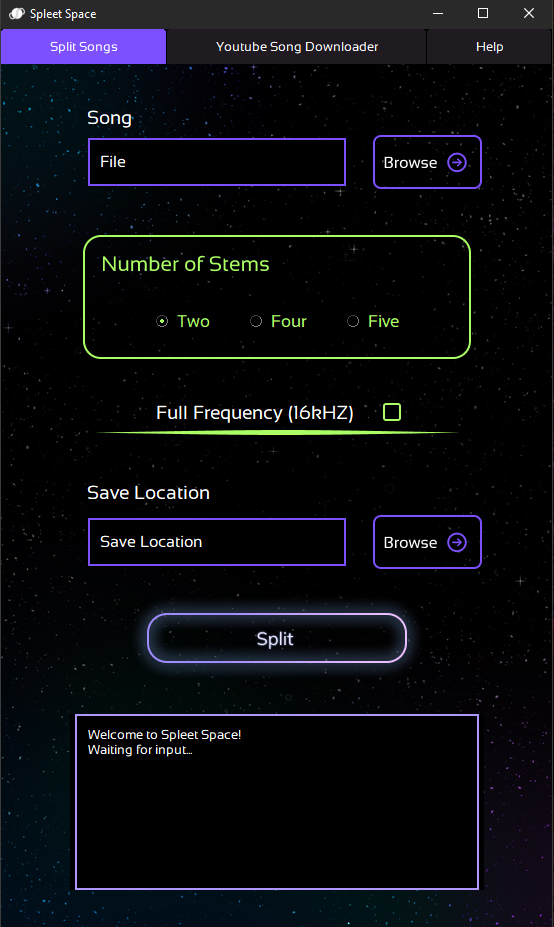

# SpleetSpace
Music separation (vocals, drums, instruments) desktop application based on the Spleeter library.
* Separate a song into 5 stems, 4 stems, 2 stems
* Supported file types for audio files: .mp3, .mp4, .m4a, .wav, .wma, .flac, .aiff, .webm, .ogg. 
* Built-in Youtube Song Downloader
* In-depth help documentation inside app: never be lost.

## Download

[Download Latest Release - v0.1](https://github.com/Mirage-Mode/SpleetSpace/releases/download/v0.1/SpleetSpace.zip) (not working on some devices - fix in progress)

## Planned Features
* Eventual support for MacOS

## Notes on Platform 
SpleetSpace has not been tested on MacOS although the code is technically cross-platform.

## Dependencies

SpleetSpace uses the Spleeter library by Deezer for splitting the audio into separate tracks and the Pytube library in the Youtube song downloader section.

The Spleeter library can be found here: [https://github.com/deezer/spleeter/tree/master/spleeter](https://github.com/deezer/spleeter/tree/master/spleeter)

The Pytube library can be found here: https://github.com/pytube/pytube

