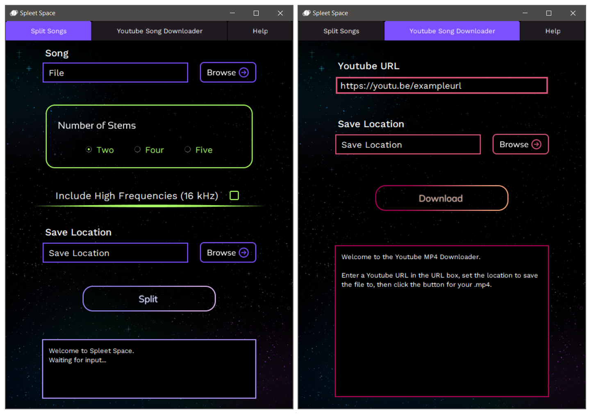

# SpleetSpace
Music separation (vocals, drums, instruments) desktop application based on the Spleeter library.
* Separate a song into 5 stems, 4 stems, 2 stems
* Built-in Youtube Song Downloader (outputs .mp4)
* Supported file types for audio files: .mp3, .mp4, .m4a, .wav, .wma, .flac, .aiff, .webm, .ogg. 

## Download and Installation
**You do NOT need to have python or spleeter installed, everything is included in the package.**

[Download Latest Release - v0.1](https://drive.google.com/file/d/1vmetiEpjmrETMxav65TTn8yx4MzHcp5P/view?usp=sharing)

[Download Large Screen Compatible Version (for high scale screens)](https://drive.google.com/file/d/1vanhgpGqvnBbkr_ewrXjfXA89FM6k7r7/view?usp=sharing)

Download the latest release by clicking on the preferred version above. Then, extract the zipped files and run "SpleetSpace.exe".

Optional: Create a Desktop shortcut to SpleetSpace. Right click SpleetSpace.exe, select "Send to", and then "Desktop (create shortcut)".   

## Planned Features
* Full support for MacOS

## Notes on Platform 
SpleetSpace has not been tested on MacOS although the program is technically cross-platform.

## Dependencies

SpleetSpace uses the Spleeter library by Deezer for splitting the audio into separate tracks and the Pytube library for the Youtube song downloader.

The Spleeter library can be found here: [https://github.com/deezer/spleeter/tree/master/spleeter](https://github.com/deezer/spleeter/tree/master/spleeter)

The Pytube library can be found here: https://github.com/pytube/pytube

